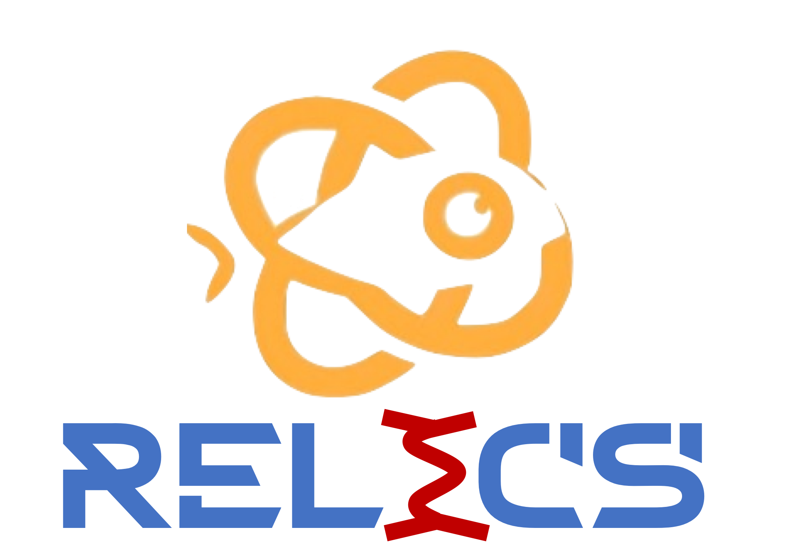

RelicsSim - A Geant4-based Monte Carlo simulation Program
========================================================




# Introduction of RelicsSim

`RelicsSim` is a [`Geant4`](https://geant4.web.cern.ch/) & [BambooMC](https://github.com/pandax-experiments/BambooMC) based simulation package. The motivation of it is to estimate various backgrounds for RELICS experiment. The package will aid sensitivity prediction and geometry design. 

## Set up environment

```bash
docker compose build
docker compose up -d
ssh -p xxxx root@x.x.x.x
echo "export RELICSSIM=path_of_this_folder" >> ~/.bashrc
```

## Geometry generator

```python
python3 ${path_to_bamboomc}/scripts/relics_xml.py ${path_to_bamboomc}/config/geo_params.json -o ${path_to_bamboomc}/config/cevns.xml [ --gen muon ] [ --run_number 1234 ] [ --enable_track ] [ --force_sd ] [ --check_overlap ] [ --save_txt ] [ --optical ] [ --get_geo_mass ]
```

`muon` can be replaced by other specified generator: `material`, `neutron`. The script uses `config/geo_params.json` as the nested geometry input. It will generate these files:

1. `config/cevns.xml`: gives the definition of the detectors, event generator, physics and analysis used for the simulation.
2. `config/cevns.json`: similar to `config/cevns.xml`
3. `data/*.txt`: if `--save_txt` specified, indices, position and rotation angle of each PMT, LXe pieces and outline of TPC tank

## Compile executable file

in `${path_to_bamboomc}/build/`, run

```bash
cmake -DENABLE_DETECTOR_SETS=relics -DENABLE_USER_MC=pandax,relics -DCMAKE_BUILD_TYPE=Debug ..
```

## Muon and muon-induced neutron

```bash
${path_to_bamboomc}/build/BambooMC -c ${path_to_bamboomc}/config/cevns.xml [ -n 100 ] [ -o muon.root ] [ -i ]
```

1. `config/cevns.xml`: geometry configuration of detectors

## Material background

```bash
ISOTOPEFILE=${path_to_bamboomc}/macro/isotopes/Kr85.mac ${path_to_bamboomc}/build/BambooMC -c ${path_to_bamboomc}/config/cevns.xml -m ${path_to_bamboomc}/macro/components/lXe.mac [ -n 100 ] [ -o material.root ] [ -i ]
```

1. `ISOTOPEFILE`: environmental variable to specify the isotope in simulation, find them in `macro/isotopes`
2. `-m`: detector component which act as radioactive source, find them in `macro/components`

## External Neutron

Please read the script to determine the input parameters.

### First step

Generate Smples.

```bash
Multi/energy/runNeutronON.sh ...
```
### Second step

Convert the sample file format.

```bash
scripts/parquet2bin.py --InputFile ${RELICSSIM}/result/NeutronON_10G/flux_neutron_ON_SIDE_0000001_0000200.parquet --OutputFile ${RELICSSIM}/data/flux_neutron_ON_SIDE_1.bin
```

### Third step

```bash
Multi/energy/runNeutronSample.sh ...
```

"sample_file_path" in "geo_params.json" is used to determine the sample file path.

## Optical

```bash
${path_to_bamboomc}/build/BambooMC -c ${path_to_bamboomc}/config/cevns.xml -m ${path_to_bamboomc}/macro/optical_S1.mac [ -n 100 ] [ -o optical.root ] [ -i ]
```

1. `-m`: type of signals, `optical_S1.mac` or `optical_S2.mac`
2. `optical_S1(2).mac` simulate energy deposition in LXe(GXe)


